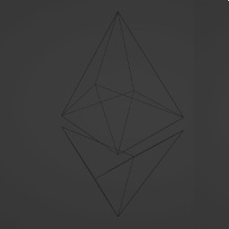
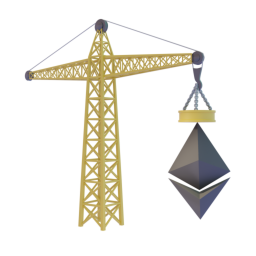
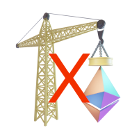

# Scaffold-Eth 3D logo

🏗️🤝🪝 Construction crane, handshake, and hook to represent building smart contracts.

🔺🔼🔻 Upward-pointing and downward-pointing triangles to represent the geometric shape of the Ethereum logo.

🟪🟦🟩  Purple, blue, and green square to represent the Ξ Ethereum logo's color scheme.

## 📝 The concept

For displaying Scaffold-eth as construction workers building a blockchain-based structure with Scaffold-eth components as tools in their hands can effectively convey the idea of collaboration and efficiency in using Scaffold-eth to build complex systems in the blockchain industry. For displaying to showcase the benefits of both technologies, such as the speed and scalability of Scaffold-eth and the transparency and security of Ethereum.

## 💡 The idea

For creating a logo involves analyzing what already exists. The logo should feature a construction crane at the center of the composition, representing the construction of smart contracts, with the crane's arm holding a geometric shape of the Ethereum logo. Additionally, simple geometric shapes can be used to create certain parts of the crane, such as the mast, control arm, and lifting beam.

## 📏 The aspect

Displaying the combination of Scaffold-eth and Ethereum in one design can be challenging, as they have different forms and characteristics. The design should accurately portray and symbolize their value and reliability. For example, the Ethereum logo features a line that symbolizes the blockchain chain, as well as lines that intersect it, representing the different participants in the Ethereum network.

## 📄 The format

You can be customized in the rendering parameters. It is typically used as a symbol, icon, animation, and scalable so that it can be displayed in various sizes without losing quality. Converting 3D models from [Blender](https://www.blender.org/) to the glTF format and loading them into [Three.js](https://threejs.org/) provides numerous possibilities for creating interactive 3D applications and websites. The 3D icon for Scaffold-eth is available in the [.blend](https://ipfs.io/ipfs/QmUGYEEkFAoBqNqnCGy4PYP3HTXVvxqgW6gSFuReHUTrN7?filename=3DIconScaffold-eth.blend)

## 🧱 Designe

- **[512](https://ipfs.io/ipfs/QmPpcaozyqWM5dDCRQ8NcPdfei136RPoBa2tTBEMUMDW1K?filename=3DIconScaffold-eth-512x512.png): Again make the websites look sharp.**
- **[1024](https://ipfs.io/ipfs/QmVkcyAPXYWY6dsHzuAYak5GDkuxEGYujNYJfnqgPET1Gf?filename=3DIconScaffold-eth-1024x1024.png): For high-resolution mobile screens.**
