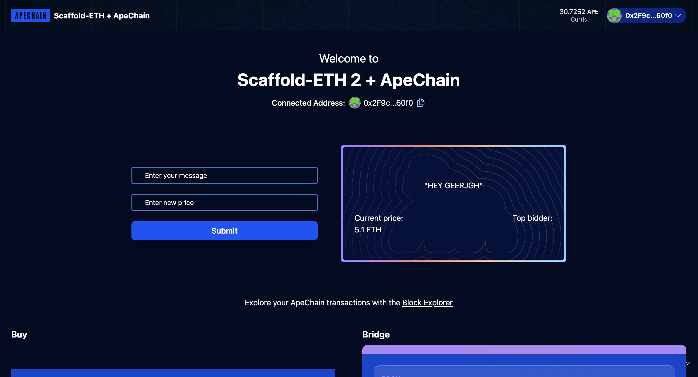

# 🏗 Apechain Scaffold-ETH 

<h4 align="center">
  <a href="https://docs.scaffoldeth.io">Documentation</a> |
  <a href="https://scaffoldeth.io">Website</a>
</h4>

🧪 An open-source, up-to-date toolkit for building decentralized applications (dapps) on the Ethereum blockchain. It's designed to make it easier for developers to create and deploy smart contracts and build user interfaces that interact with those contracts.

⚙️ Built using NextJS, RainbowKit, Hardhat, Wagmi, Viem, and Typescript.

- ✅ **Contract Hot Reload**: Your frontend auto-adapts to your smart contract as you edit it.
- 🪝 **[Custom hooks](https://docs.scaffoldeth.io/hooks/)**: Collection of React hooks wrapper around [wagmi](https://wagmi.sh/) to simplify interactions with smart contracts with typescript autocompletion.
- 🧱 [**Components**](https://docs.scaffoldeth.io/components/): Collection of common web3 components to quickly build your frontend.
- 🔥 **Burner Wallet & Local Faucet**: Quickly test your application with a burner wallet and local faucet.
- 🔐 **Integration with Wallet Providers**: Connect to different wallet providers and interact with the Ethereum network.



## Requirements

Before you begin, you need to install the following tools:

- [Node (>= v22.0)](https://nodejs.org/en/download/)
- [Git](https://git-scm.com/downloads)
- Package Manager (choose one):
  - [Yarn (v3.2.3)](https://yarnpkg.com/getting-started/install) - Note: This project uses Yarn 3.2.3 which is included in the project. You don't need to install Yarn globally.
  - [pnpm](https://pnpm.io/installation)

## Quickstart

To get started with Scaffold-ETH 2, follow the steps below:

1. Clone this repo

```
git clone https://github.com/ape-foundation/scaffold-eth-2_ape.git
```

2. Install packages (Yarn or pnpm):

Using Yarn:
```
yarn install
```

Using pnpm:
```
pnpm install
```

3. Navigate to packages/nextjs

```
cd packages/nextjs
```

4. Run the following command on your terminal

```
curl -sSL -o .npmrc https://raw.githubusercontent.com/yuga-labs/ape-portal-public/2bd5d6c85cbb8dfc276c054ddeb0f55a1df459aa/.npmrc
```

5. Add github token to your shell:
```
export GITHUB_TOKEN=<github-token>
```

6. Install ApePortal package:

Using Yarn:
```
yarn add @yuga-labs/ape-portal-public
```

Using pnpm:
```
pnpm i @yuga-labs/ape-portal-public
```

7. Navigate back to root folder
```
cd ../..
```

8. Run a local network in the first terminal:

Using Yarn:
```
yarn chain
```

Using pnpm:
```
pnpm chain
```

This command starts a local Ethereum network using Hardhat. The network runs on your local machine and can be used for testing and development. You can customize the network configuration in `hardhat.config.ts`.

9. On a second terminal, deploy the test contract:

Using Yarn:
```
yarn deploy
```

Using pnpm:
```
pnpm deploy
```

This command deploys a test smart contract to the local network. The contract is located in `packages/hardhat/contracts` and can be modified to suit your needs. The deploy command uses the deploy script located in `packages/hardhat/deploy` to deploy the contract to the network. You can also customize the deploy script.

10. On a third terminal, start your NextJS app:

Using Yarn:
```
yarn start
```

Using pnpm:
```
pnpm start
```

Visit your app on: `http://localhost:3000`. You can interact with your smart contract using the `Debug Contracts` page. You can tweak the app config in `packages/nextjs/scaffold.config.ts`.

**What's next**:

- Edit your smart contract `YourContract.sol` in `packages/hardhat/contracts`
- Edit your frontend homepage at `packages/nextjs/app/page.tsx`. For guidance on [routing](https://nextjs.org/docs/app/building-your-application/routing/defining-routes) and configuring [pages/layouts](https://nextjs.org/docs/app/building-your-application/routing/pages-and-layouts) checkout the Next.js documentation.
- Edit your deployment scripts in `packages/hardhat/deploy`
- Edit your smart contract test in: `packages/hardhat/test`. To run test use `yarn hardhat:test` or `pnpm hardhat:test`

## Documentation

Visit our [docs](https://docs.scaffoldeth.io) to learn how to start building with Scaffold-ETH 2.

To know more about its features, check out our [website](https://scaffoldeth.io).

## Contributing to Scaffold-ETH 2

We welcome contributions to Scaffold-ETH 2!

Please see [CONTRIBUTING.MD](https://github.com/scaffold-eth/scaffold-eth-2/blob/main/CONTRIBUTING.md) for more information and guidelines for contributing to Scaffold-ETH 2.
